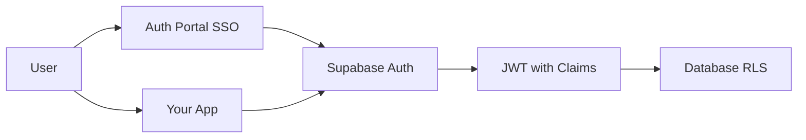

# Access Broker Documentation

Access Broker provides centralized authentication, authorization, and user management for single or multi-application environments built on Supabase.

Not sure where to start? Choose your documentation track below.

## Three Documentation Tracks

**[Integrator](/docs/integrator)** — Connect your app to Access Broker for SSO and claims-based authorization

**[Operator](/docs/operator)** — Deploy and manage the Access Broker platform for your organization

**[Concepts](/docs/concepts)** — Understand authentication, authorization, claims, and roles

## Do I need this?

**Answer these questions first:**

| Question | If YES | If NO |
| --- | --- | --- |
| Do you have **multiple apps** sharing one Supabase project? | This is for you | Maybe overkill |
| Do you need **per-app roles/permissions** (not just global roles)? | This is for you | Use vanilla Supabase Auth |
| Do you want a **central SSO portal** for all your apps? | This is for you | Use Supabase Auth directly |
| Do you need an **admin dashboard** to manage users across apps? | This is for you | Use Supabase Dashboard |
| Do you just need **basic auth** (sign up, sign in, protected routes)? | Skip to [Simple Auth Guide](#simple-auth-just-supabase) | — |

### Simple Auth (Just Supabase)

If you just need authentication for a single app without multi-app claims, you don't need this project. Use Supabase Auth directly:

```bash
pnpm add @supabase/supabase-js @supabase/ssr
```

```typescript
// Sign up
const { data, error } = await supabase.auth.signUp({ email, password });

// Sign in
const { data, error } = await supabase.auth.signInWithPassword({ email, password });

// Get user
const {
  data: { user },
} = await supabase.auth.getUser();

// Protect routes in middleware
if (!user) redirect('/login');
```

See [Supabase Auth Docs](https://supabase.com/docs/guides/auth) for the official guide.

**Come back here when you need:**

- Multiple apps with different access levels
- Custom claims in JWT tokens for RLS policies
- Centralized user management dashboard
- SSO across multiple domains

---

## What this project provides

| Component | What it does |
| --- | --- |
| **SQL Functions** | `set_claim`, `set_app_claim`, etc. — manage JWT claims stored in `app_metadata` |
| **Admin Dashboard** | Web UI to manage users, apps, roles, and permissions |
| **Auth Portal** | Optional SSO hub with passkeys, OAuth, MFA for multi-app environments |
| **TypeScript Helpers** | Type-safe claim reading and middleware patterns |

You can use **just the SQL functions** without the dashboard, or deploy the **full platform**.

## System Overview



---

## Choose your path

### Path 1: I want to integrate my app with Access Broker

You want to connect your application to Access Broker for SSO and claims-based authorization.

**→ [Start with the Integrator Track](/docs/integrator)**

### Path 2: I want to deploy and manage Access Broker

You're setting up and operating the Access Broker platform for your organization.

**→ [Start with the Operator Track](/docs/operator)**

### Path 3: I want to understand the fundamentals first

You want to learn about authentication, authorization, claims, and roles before diving into implementation.

**→ [Start with Concepts](/docs/concepts)**

### Path 4: I'm an AI agent helping a developer

1. [Agent Context](./reference/agent-context.md) — system overview
2. [Agent Instructions: Auth Portal](./reference/auth-portal-agent-instructions.md) — copy/paste tasks

## Core implementation docs (recommended reading order)

1. **[Quick Start](/docs/operator/quick-start)** — end-to-end sign-up/sign-in + access gate
2. **[Complete Integration Guide](/docs/integrator/complete-integration-guide)** — deeper walkthrough
3. **[Authentication Guide](/docs/concepts/authentication-guide)** — auth patterns (OTP, OAuth, callbacks)
4. **[Session Management](/docs/concepts/session-management)** — session lifecycle and persistence
5. **[Logout Guide](/docs/concepts/logout-guide)** — internal logout, SSO logout, and Single Logout (SLO)
6. **[Claims Guide](/docs/concepts/claims-guide)** — how claims work + constraints
7. **[Role Management Guide](/docs/concepts/role-management-guide)** — database-backed roles and permissions
8. **[Admin Types and Permissions](/docs/concepts/admin-types)** — global vs app admin vs admin role
9. **[Role Frontend Patterns](/docs/integrator/role-frontend-patterns)** — UI patterns for roles/permissions
10. **[Role Management Examples](/docs/integrator/role-examples)** — copy/paste scenarios
11. **[Authorization Patterns](/docs/concepts/authorization-patterns)** — RBAC/permissions patterns
12. **[RLS Policies](/docs/concepts/rls-policies)** — database security using JWT claims
13. **[Environment Configuration](/docs/operator/environment-configuration)** — production deployment + redirect safety

## Reference / Quick copy-paste

- **[Glossary](/docs/concepts/glossary)** — definitions of terms (claims, JWT, RLS, etc.)
- **[Auth Quick Reference](/docs/integrator/auth-quick-reference)**
- **[Shared Auth Patterns](/docs/concepts/shared-patterns)** — canonical setup snippets
- **[Agent Context](/docs/agent-context)**

## SSO & Auth Portal

- **[SSO Integration Guide](/docs/integrator/sso-integration-guide)** — integrate your app with the central auth portal
- **[Logout Guide](/docs/concepts/logout-guide)** — implement logout for internal apps and SSO clients (SLO)
- **[Auth Portal (SSO + Passkeys)](/docs/operator/auth-portal-sso-passkeys)** — technical spec (API, DB schema)
- **[Agent Instructions: Auth Portal](/docs/auth-portal-agent-instructions)** — copy/paste tasks for AI agents

## Advanced topics

- **[Multi-App Guide](/docs/operator/multi-app-guide)**
- **[API Keys Guide](/docs/operator/api-keys-guide)**
- **[Connected Accounts](/docs/operator/connected-accounts)**
- **[App Auth Integration](/docs/integrator/app-auth-integration)**

## Contributing (codebase docs)

These are intentionally separate from implementation docs:

- [Architecture](/docs/architecture)
- [Development](/docs/development)
- [Contributing](/docs/contributing)
