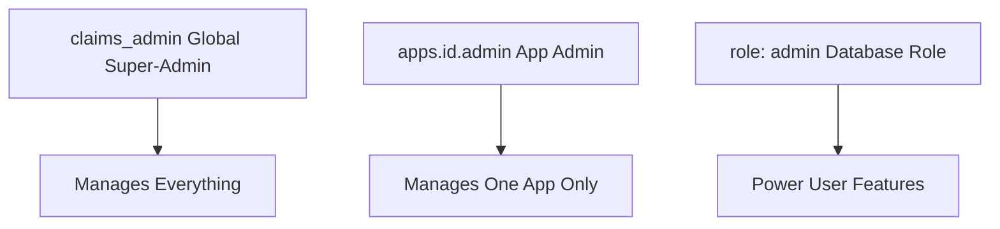

# Admin Types and Permissions

**Context:** This system has **three distinct admin concepts** that serve different purposes. Understanding the differences is critical for correct authorization.



## The Three Types of Admins

### 1. Global Super-Admin (`claims_admin`)

**What it is:** A special claim flag that grants full system access.

**Location:** `app_metadata.claims_admin: true`

**Powers:**
- ✅ Manage all users across all apps
- ✅ Create, update, and delete apps
- ✅ Create, update, and delete roles
- ✅ Grant/revoke app admin rights
- ✅ Access admin dashboard
- ✅ Modify any user's claims
- ✅ Full database access (if RLS policies allow)

**Use Case:** System administrators who manage the entire platform

**How to Grant:**
```sql
-- Via SQL Editor (one-time bootstrap)
SELECT set_claim('user-id'::uuid, 'claims_admin', 'true');
```

**Example User:**
```json
{
  "claims_admin": true,  // ← Global super-admin
  "apps": {
    "blog-app": {
      "enabled": true,
      "role": "viewer"  // Can still have regular roles in apps
    }
  }
}
```

**Security Note:** This is the highest privilege level. Only grant to trusted administrators.

### 2. App-Specific Admin (`apps.{app_id}.admin`)

**What it is:** A flag that grants admin rights for a specific application only.

**Location:** `app_metadata.apps.{app_id}.admin: true`

**Powers (for that app only):**
- ✅ Manage users who have access to their app
- ✅ View and modify app-specific claims for users
- ✅ Assign roles to users (for their app)
- ❌ Cannot grant app admin rights
- ❌ Cannot manage global claims
- ❌ Cannot manage other apps
- ❌ Cannot create/delete apps or roles

**Use Case:** Application owners who manage their specific app's users

**How to Grant:**
```typescript
import { toggleAppAdminAction } from '@/app/actions/claims';

// Grant app admin status
await toggleAppAdminAction('user-id', 'blog-app', true);
```

**Example User:**
```json
{
  "claims_admin": false,  // Not a global admin
  "apps": {
    "blog-app": {
      "enabled": true,
      "role": "editor",
      "admin": true  // ← App-specific admin for blog-app
    },
    "forum-app": {
      "enabled": true,
      "role": "moderator"  // Regular user in forum-app
    }
  }
}
```

**Use Case Example:**
- Blog app owner can manage blog users
- Cannot see or manage forum app users
- Cannot make other users app admins

### 3. Admin Role (Database Role)

**What it is:** A regular role from the `roles` table that happens to be named "admin" (or similar).

**Location:** `roles` table + assigned via `app_metadata.apps.{app_id}.role: "admin"`

**Powers:** Whatever permissions are defined in the role's `permissions` array

**This is NOT a special privilege** - it's just a role name with associated permissions.

**How to Create:**
```sql
SELECT create_role(
  'admin',                    -- Just a name, no special meaning
  'Administrator',
  'Full access to blog features',
  'blog-app',
  false,
  '["read", "write", "delete", "publish", "moderate"]'::jsonb
);
```

**How to Assign:**
```typescript
import { setAppRoleAction } from '@/app/actions/claims';

// Assign "admin" role (just like any other role)
await setAppRoleAction('user-id', 'blog-app', 'admin');
```

**Example User:**
```json
{
  "claims_admin": false,
  "apps": {
    "blog-app": {
      "enabled": true,
      "role": "admin"  // ← Has "admin" role (from roles table)
      // No "admin: true" flag - not an app admin
    }
  }
}
```

**Important:** Having `role: "admin"` does NOT make you an app admin! You need `admin: true` for that.

## Comparison Table

| Aspect | `claims_admin` | `apps.{id}.admin` | `role: "admin"` |
|--------|---------------|-------------------|-----------------|
| **Type** | Global flag | App-specific flag | Regular role |
| **Scope** | All apps | One app | One app |
| **Can manage users** | All users | App users only | No (unless given permission) |
| **Can create roles** | ✅ Yes | ❌ No | ❌ No |
| **Can grant app admin** | ✅ Yes | ❌ No | ❌ No |
| **Access dashboard** | ✅ Full access | ✅ Limited to their app | ❌ No |
| **Defined in** | Hardcoded system flag | Hardcoded system flag | `roles` table |
| **Typical use** | Platform admin | App owner | Power user |

## Authorization Check Examples

**Check for global super-admin:**
```typescript
const isGlobalAdmin = user?.app_metadata?.claims_admin === true;

if (isGlobalAdmin) {
  // Can do anything
}
```

**Check for app-specific admin:**
```typescript
const isAppAdmin = user?.app_metadata?.apps?.['blog-app']?.admin === true;
const isGlobalAdmin = user?.app_metadata?.claims_admin === true;

if (isGlobalAdmin || isAppAdmin) {
  // Can manage blog-app users
}
```

**Check for "admin" role:**
```typescript
const userRole = user?.app_metadata?.apps?.['blog-app']?.role;

if (userRole === 'admin') {
  // Has admin role permissions (from roles table)
}
```

**In RLS Policies:**
```sql
-- Global super-admins can do anything
CREATE POLICY "Global admins have full access"
ON any_table FOR ALL
USING (
  COALESCE(
    (auth.jwt() -> 'app_metadata' ->> 'claims_admin')::boolean,
    false
  ) = true
);

-- App admins can manage their app's data
CREATE POLICY "App admins can manage app data"
ON app_data FOR ALL
USING (
  -- Global admin
  COALESCE(
    (auth.jwt() -> 'app_metadata' ->> 'claims_admin')::boolean,
    false
  ) = true
  OR
  -- App-specific admin
  COALESCE(
    (auth.jwt() -> 'app_metadata' -> 'apps' -> app_id ->> 'admin')::boolean,
    false
  ) = true
);

-- Users with "admin" role can access admin features
CREATE POLICY "Admin role can access features"
ON blog_posts FOR ALL
USING (
  (auth.jwt() -> 'app_metadata' -> 'apps' -> 'blog-app' ->> 'role')
    IN ('admin', 'editor')
);
```

## Combining Admin Types

A user can have multiple admin attributes:

```json
{
  "claims_admin": true,  // Global super-admin
  "apps": {
    "blog-app": {
      "enabled": true,
      "role": "admin",    // Has admin role
      "admin": true       // Also app admin for blog-app
    }
  }
}
```

**Best Practice:** Keep it simple. Usually pick one:
- **Global admin** → Full system access
- **App admin** → Manage specific app
- **Admin role** → App-specific power user

## When to Use Each

**Use `claims_admin` for:**
- Platform administrators
- System maintainers
- Users who need to manage multiple apps
- Bootstrap/initial admin users

**Use `apps.{id}.admin` for:**
- Application owners
- Team leads for specific apps
- Delegated administration
- Multi-tenant scenarios where app owners manage their users

**Use "admin" role for:**
- Power users within an app
- Users with elevated permissions (but not admin rights)
- Role-based feature access
- Fine-grained permission control

## Security Considerations

1. **Least Privilege:** Don't grant `claims_admin` unless necessary
2. **Audit Trail:** Log when admin privileges are granted/revoked
3. **Regular Review:** Periodically audit who has admin access
4. **Separation of Concerns:** App admins should not have global access

**Query all admins:**
```sql
-- Find global admins
SELECT email, created_at
FROM auth.users
WHERE (raw_app_meta_data->'claims_admin')::bool = true;

-- Find app admins for specific app
SELECT email,
       raw_app_meta_data->'apps'->'blog-app'->>'role' as role
FROM auth.users
WHERE (raw_app_meta_data->'apps'->'blog-app'->>'admin')::bool = true;

-- Find users with "admin" role
SELECT email,
       raw_app_meta_data->'apps'->'blog-app'->>'role' as role
FROM auth.users
WHERE raw_app_meta_data->'apps'->'blog-app'->>'role' = 'admin';
```

## Related Documentation

- [Role Management Guide](/docs/role-management-guide)
- [Authorization Patterns](/docs/authorization-patterns)
- [RLS Policies](/docs/rls-policies)
