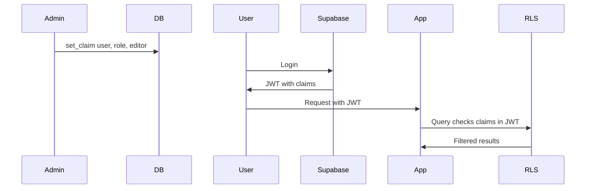

# Supabase Custom Claims Guide

**TL;DR:**
- Claims live in `app_metadata` and are included in JWTs
- Use claims for roles, features, and app access
- Refresh sessions after changing claims
- Avoid sensitive or frequently changing data in claims

**Time to read:** 25 minutes | **Prerequisites:** [Installation](/docs/installation) | **Next steps:** [Role Management Guide](/docs/role-management-guide)

## What are Custom Claims?

Custom Claims are special attributes attached to a user that you can use to control access to portions of your application. They're stored in the `raw_app_meta_data` field of the `auth.users` table and are included in the user's JWT access token.

### Example Claims

```json
{
  "plan": "TRIAL",
  "user_level": 100,
  "group_name": "Super Guild!",
  "joined_on": "2022-05-20T14:28:18.217Z",
  "group_manager": false,
  "items": ["toothpick", "string", "ring"],
  "claims_admin": true
}
```

## Why Use Custom Claims?

### Performance Benefits

Custom claims are stored in the JWT token, making them available to:
- Your application (client-side)
- PostgreSQL database (via `current_setting('request.jwt.claims', true)`)
- RLS (Row Level Security) policies

**No database queries needed!** This can eliminate thousands or millions of database calls when checking permissions, especially in RLS policies.

### Claims Flow



### Use Cases

- ✅ Authorization and permissions
- ✅ Feature flags
- ✅ Subscription tiers/plans
- ✅ User roles and groups
- ✅ Rate limiting metadata
- ✅ Temporary access grants

### When NOT to Use Claims

❌ Frequently changing data (requires session refresh)
❌ Large amounts of data (increases token size)
❌ Sensitive secrets (claims are in JWT, readable by client)
❌ User profile data (use `raw_user_meta_data` instead)

## Installation

### 1. Install the SQL Functions

Copy the contents of `install.sql` and run it in your Supabase SQL Editor:

```sql
-- The file includes these functions:
-- - get_claims(uid uuid)
-- - get_claim(uid uuid, claim text)
-- - set_claim(uid uuid, claim text, value jsonb)
-- - delete_claim(uid uuid, claim text)
-- - get_my_claims()
-- - get_my_claim(claim text)
-- - is_claims_admin()
```

Go to: https://app.supabase.com/project/YOUR-PROJECT/sql

### 2. Bootstrap Your First Admin

Grant yourself claims_admin access:

```sql
select set_claim('YOUR-USER-ID', 'claims_admin', 'true');
```

Find your user ID in: **Authentication → Users** in the Supabase dashboard.

**Important:** `claims_admin` is a global super-admin flag. For a complete explanation of different admin types (global admin, app admin, and admin roles), see **[Admin Types and Permissions](/docs/admin-types)**.

## Usage

### In the Dashboard (This App)

The dashboard provides a UI for all claim operations:
- View all users and their claims
- Add new claims with JSON validation
- Edit existing claims
- Delete claims
- Toggle claims_admin status

### In SQL Editor

#### Get All Claims for a User

```sql
select get_claims('03acaa13-7989-45c1-8dfb-6eeb7cf0b92e');
```

#### Get a Specific Claim

```sql
select get_claim('03acaa13-7989-45c1-8dfb-6eeb7cf0b92e', 'user_level');
```

#### Set Claims (Different Types)

**Number:**
```sql
select set_claim('user-id', 'user_level', '200');
```

**String:** (requires double quotes)
```sql
select set_claim('user-id', 'user_role', '"MANAGER"');
```

**Boolean:**
```sql
select set_claim('user-id', 'useractive', 'true');
```

**Array:**
```sql
select set_claim('user-id', 'items', '["bread", "cheese", "butter"]');
```

**Object:**
```sql
select set_claim('user-id', 'gamestate', '{"level": 5, "items": ["knife", "gun"]}');
```

#### Delete a Claim

```sql
select delete_claim('user-id', 'gamestate');
```

### In Your Application (JavaScript/TypeScript)

#### Reading Claims from Session

```typescript
supabase.auth.onAuthStateChange((_event, session) => {
  if (session?.user) {
    console.log(session.user.app_metadata); // All custom claims
    const userLevel = session.user.app_metadata.user_level;
    const isAdmin = session.user.app_metadata.claims_admin;
  }
});
```

#### React Hook for Claims

```typescript
// hooks/useClaims.ts
'use client';

import { useEffect, useState } from 'react';
import { createClient } from '@/lib/supabase/client';

export function useClaims() {
  const [claims, setClaims] = useState<Record<string, any>>({});
  const [loading, setLoading] = useState(true);
  const supabase = createClient();

  useEffect(() => {
    async function loadClaims() {
      const { data: { user } } = await supabase.auth.getUser();
      setClaims(user?.app_metadata || {});
      setLoading(false);
    }

    loadClaims();

    // Listen for auth changes
    const { data: { subscription } } = supabase.auth.onAuthStateChange(() => {
      loadClaims();
    });

    return () => subscription.unsubscribe();
  }, [supabase]);

  const getClaim = (claimName: string) => {
    return claims[claimName];
  };

  const getAppClaim = (appId: string, claimName: string) => {
    return claims?.apps?.[appId]?.[claimName];
  };

  return { claims, getClaim, getAppClaim, loading };
}

// Usage in component
export function UserProfile() {
  const { claims, getClaim, getAppClaim, loading } = useClaims();

  if (loading) return <div>Loading...</div>;

  const userLevel = getClaim('user_level');
  const blogRole = getAppClaim('blog-app', 'role');

  return (
    <div>
      <p>Level: {userLevel}</p>
      <p>Blog Role: {blogRole}</p>
    </div>
  );
}
```

#### Conditional Rendering Based on Claims

```typescript
// components/ClaimGate.tsx
'use client';

import { useClaims } from '@/hooks/useClaims';
import { ReactNode } from 'react';

interface ClaimGateProps {
  claim: string;
  value: any;
  operator?: 'equals' | 'greaterThan' | 'lessThan' | 'includes';
  children: ReactNode;
  fallback?: ReactNode;
}

export function ClaimGate({
  claim,
  value,
  operator = 'equals',
  children,
  fallback = null
}: ClaimGateProps) {
  const { getClaim, loading } = useClaims();

  if (loading) return null;

  const claimValue = getClaim(claim);
  let hasAccess = false;

  switch (operator) {
    case 'equals':
      hasAccess = claimValue === value;
      break;
    case 'greaterThan':
      hasAccess = claimValue > value;
      break;
    case 'lessThan':
      hasAccess = claimValue < value;
      break;
    case 'includes':
      hasAccess = Array.isArray(claimValue) && claimValue.includes(value);
      break;
  }

  return hasAccess ? <>{children}</> : <>{fallback}</>;
}

// Usage
export function PremiumFeatures() {
  return (
    <>
      {/* Show for users with premium plan */}
      <ClaimGate claim="plan" value="PREMIUM">
        <PremiumDashboard />
      </ClaimGate>

      {/* Show for high-level users */}
      <ClaimGate claim="user_level" value={100} operator="greaterThan">
        <AdvancedFeatures />
      </ClaimGate>

      {/* Show for users with specific permission */}
      <ClaimGate claim="permissions" value="export" operator="includes">
        <ExportButton />
      </ClaimGate>
    </>
  );
}
```

#### Server Component with Claims

```typescript
// app/dashboard/page.tsx
import { createClient } from '@/lib/supabase/server';
import { redirect } from 'next/navigation';

export default async function DashboardPage() {
  const supabase = await createClient();
  const { data: { user } } = await supabase.auth.getUser();

  if (!user) {
    redirect('/login');
  }

  // Access claims
  const userLevel = user.app_metadata?.user_level || 0;
  const plan = user.app_metadata?.plan;
  const isClaimsAdmin = user.app_metadata?.claims_admin === true;

  return (
    <div>
      <h1>Dashboard</h1>
      <p>Your level: {userLevel}</p>
      <p>Your plan: {plan}</p>

      {isClaimsAdmin && (
        <a href="/admin">Admin Panel</a>
      )}

      {userLevel > 50 && (
        <div>
          <h2>Premium Features</h2>
          {/* Premium content */}
        </div>
      )}
    </div>
  );
}
```

#### Managing Claims from Frontend

```typescript
// components/ClaimManager.tsx
'use client';

import { useState } from 'react';
import { Button } from '@/components/ui/button';
import { Input } from '@/components/ui/input';
import { toast } from 'sonner';

export function ClaimManager({ userId }: { userId: string }) {
  const [claimName, setClaimName] = useState('');
  const [claimValue, setClaimValue] = useState('');
  const [saving, setSaving] = useState(false);

  const handleSetClaim = async () => {
    setSaving(true);

    try {
      // Parse JSON value
      const parsedValue = JSON.parse(claimValue);

      const response = await fetch('/api/claims/set', {
        method: 'POST',
        headers: { 'Content-Type': 'application/json' },
        body: JSON.stringify({
          userId,
          claim: claimName,
          value: parsedValue
        })
      });

      if (!response.ok) {
        throw new Error('Failed to set claim');
      }

      toast.success('Claim updated successfully');
      setClaimName('');
      setClaimValue('');
    } catch (error) {
      toast.error('Failed to set claim. Check JSON format.');
    } finally {
      setSaving(false);
    }
  };

  return (
    <div className="space-y-4">
      <div>
        <label className="block text-sm font-medium mb-2">
          Claim Name
        </label>
        <Input
          value={claimName}
          onChange={(e) => setClaimName(e.target.value)}
          placeholder="e.g., user_level"
        />
      </div>

      <div>
        <label className="block text-sm font-medium mb-2">
          Claim Value (JSON)
        </label>
        <Input
          value={claimValue}
          onChange={(e) => setClaimValue(e.target.value)}
          placeholder='e.g., 100 or "PREMIUM" or ["read","write"]'
        />
      </div>

      <Button
        onClick={handleSetClaim}
        disabled={saving || !claimName || !claimValue}
      >
        {saving ? 'Saving...' : 'Set Claim'}
      </Button>
    </div>
  );
}
```

#### Using RPC Functions

**For Current User:**

```typescript
// Get all my claims
const { data, error } = await supabase.rpc('get_my_claims');

// Get a specific claim
const { data, error } = await supabase.rpc('get_my_claim', {
  claim: 'user_level'
});

// Check if I'm an admin
const { data, error } = await supabase.rpc('is_claims_admin');
```

#### API Route Examples (Next.js App Router)

**Get user claims:**

```typescript
// app/api/claims/[userId]/route.ts
import { createClient } from '@/lib/supabase/server';
import { NextResponse } from 'next/server';

export async function GET(
  request: Request,
  { params }: { params: { userId: string } }
) {
  const supabase = await createClient();

  // Verify requester is admin
  const { data: { user: requester } } = await supabase.auth.getUser();
  if (!requester?.app_metadata?.claims_admin) {
    return NextResponse.json(
      { error: 'Unauthorized' },
      { status: 403 }
    );
  }

  // Get claims for target user
  const { data, error } = await supabase.rpc('get_claims', {
    uid: params.userId
  });

  if (error) {
    return NextResponse.json({ error: error.message }, { status: 500 });
  }

  return NextResponse.json(data);
}
```

**Set claim:**

```typescript
// app/api/claims/set/route.ts
import { createClient } from '@/lib/supabase/server';
import { NextResponse } from 'next/server';

export async function POST(request: Request) {
  const supabase = await createClient();

  // Verify requester is admin
  const { data: { user: requester } } = await supabase.auth.getUser();
  if (!requester?.app_metadata?.claims_admin) {
    return NextResponse.json(
      { error: 'Unauthorized' },
      { status: 403 }
    );
  }

  const body = await request.json();
  const { userId, claim, value } = body;

  // Validate input
  if (!userId || !claim || value === undefined) {
    return NextResponse.json(
      { error: 'Missing required fields' },
      { status: 400 }
    );
  }

  // Set claim
  const { data, error } = await supabase.rpc('set_claim', {
    uid: userId,
    claim,
    value
  });

  if (error) {
    return NextResponse.json({ error: error.message }, { status: 500 });
  }

  return NextResponse.json({ success: true });
}
```

**Delete claim:**

```typescript
// app/api/claims/delete/route.ts
import { createClient } from '@/lib/supabase/server';
import { NextResponse } from 'next/server';

export async function POST(request: Request) {
  const supabase = await createClient();

  // Verify requester is admin
  const { data: { user: requester } } = await supabase.auth.getUser();
  if (!requester?.app_metadata?.claims_admin) {
    return NextResponse.json(
      { error: 'Unauthorized' },
      { status: 403 }
    );
  }

  const body = await request.json();
  const { userId, claim } = body;

  const { data, error } = await supabase.rpc('delete_claim', {
    uid: userId,
    claim
  });

  if (error) {
    return NextResponse.json({ error: error.message }, { status: 500 });
  }

  return NextResponse.json({ success: true });
}
```

**For Any User (Requires claims_admin):**

```typescript
// Get all claims for a user
const { data, error } = await supabase.rpc('get_claims', {
  uid: 'user-id'
});

// Get specific claim for a user
const { data, error } = await supabase.rpc('get_claim', {
  uid: 'user-id',
  claim: 'user_level'
});

// Set a claim for a user
const { data, error } = await supabase.rpc('set_claim', {
  uid: 'user-id',
  claim: 'user_level',
  value: 100
});

// Delete a claim for a user
const { data, error } = await supabase.rpc('delete_claim', {
  uid: 'user-id',
  claim: 'user_level'
});
```

### In Row Level Security (RLS) Policies

Use claims to control database access:

#### Only Allow Managers

```sql
get_my_claim('user_role') = '"MANAGER"'::jsonb
```

#### Only Allow High-Level Users

```sql
coalesce(get_my_claim('user_level')::numeric, 0) > 100
```

#### Only Allow Claims Admins

```sql
coalesce(get_my_claim('claims_admin')::bool, false)
```

### In PostgreSQL Functions and Triggers

Use any of the claim functions inside your database code:

```sql
CREATE OR REPLACE FUNCTION check_user_permissions()
RETURNS trigger AS $$
BEGIN
  -- Check if user has required claim
  IF get_my_claim('can_edit') != 'true'::jsonb THEN
    RAISE EXCEPTION 'Permission denied';
  END IF;

  RETURN NEW;
END;
$$ LANGUAGE plpgsql SECURITY DEFINER;
```

## Working with Roles

### Roles vs Claims

**This system includes database-backed roles** that provide a structured way to manage user permissions:

| Aspect | Roles | Claims |
|--------|-------|--------|
| **Storage** | PostgreSQL `roles` table | User's `raw_app_meta_data` |
| **Purpose** | Define permission templates | Assign permissions to users |
| **Examples** | Role definitions with permissions | User has `role: "editor"` |

### How Roles Work

**1. Define roles in database:**
```sql
-- Create a role with permissions
SELECT create_role(
  'editor',              -- name
  'Content Editor',      -- label
  'Can edit content',    -- description
  'blog-app',           -- app_id
  false,                -- is_global
  '["read", "write", "publish"]'::jsonb -- permissions
);
```

**2. Assign role to user via claims:**
```sql
-- Set user's role claim
SELECT set_app_claim(
  'user-id'::uuid,
  'blog-app',
  'role',
  '"editor"'::jsonb
);
```

**3. Check role in authorization:**
```typescript
const userRole = user?.app_metadata?.apps?.['blog-app']?.role;
if (userRole === 'editor') {
  // Grant editor access
}
```

### Role Types

**Global Roles** - Available across all apps:
```sql
SELECT create_role(
  'employee',
  'Employee',
  'Standard employee access',
  NULL,     -- No app_id = global
  true,     -- is_global
  '["read"]'::jsonb
);
```

**App-Specific Roles** - Only for specific app:
```sql
SELECT create_role(
  'blog_editor',
  'Blog Editor',
  'Can edit blog posts',
  'blog-app',  -- Specific app
  false,       -- Not global
  '["read", "write", "publish"]'::jsonb
);
```

### Querying Roles

**Get all roles for an app:**
```sql
SELECT * FROM get_app_roles('blog-app');
```

**Get only global roles:**
```sql
SELECT * FROM get_global_roles();
```

**In TypeScript:**
```typescript
import { getRoles, getGlobalRoles } from '@/lib/apps-service';

const roles = await getRoles('blog-app');  // Includes global roles
const globalOnly = await getGlobalRoles();
```

### Role-Based Authorization

**Check user's role:**
```typescript
// In your app
const { data: { user } } = await supabase.auth.getUser();
const userRole = user?.app_metadata?.apps?.['blog-app']?.role;

if (userRole === 'editor' || userRole === 'admin') {
  // Allow editing
}
```

**In RLS policies:**
```sql
CREATE POLICY "Editors can update posts"
ON blog_posts
FOR UPDATE
USING (
  (auth.jwt() -> 'app_metadata' -> 'apps' -> 'blog-app' ->> 'role')
    IN ('editor', 'admin')
);
```

### Learn More

For complete role management documentation, see:
- **[Role Management Guide](/docs/role-management-guide)** - Complete guide to database-backed roles
- **[Authorization Patterns](/docs/authorization-patterns)** - Using roles in authorization
- **[RLS Policies](/docs/rls-policies)** - Role-based database security

## Querying Users by Claims

Find users with specific claims:

**Find all admins:**
```sql
SELECT * FROM auth.users
WHERE (raw_app_meta_data->'claims_admin')::bool = true;
```

**Find users with level > 100:**
```sql
SELECT * FROM auth.users
WHERE (raw_app_meta_data->'user_level')::numeric > 100;
```

**Find users with specific role:**
```sql
SELECT * FROM auth.users
WHERE (raw_app_meta_data->'user_role')::text = '"MANAGER"';

-- Or for app-specific roles:
SELECT * FROM auth.users
WHERE raw_app_meta_data->'apps'->'blog-app'->>'role' = 'editor';
```

## Important Notes

### Session Refresh

When you update a claim, users need to refresh their session to see changes:

**In your app:**
```typescript
await supabase.auth.refreshSession();
```

**Or ask users to log out and back in.**

### Reserved Claim Names

❌ **Avoid these names:**
- `provider` - Used by Supabase Auth
- `providers` - Used by Supabase Auth
- `exp` - Reserved by JWT standard

✅ **About `role`:**
- `role` is reserved by Supabase Realtime, not Supabase Auth
- It's safe to use `role` in `app_metadata` for authorization
- If you use Supabase Realtime, prefer prefixed names like `myapp_role`

✅ **Best practice:** Use prefixed names like `myapp_role`, `myapp_level`, etc.

### Data Types

All claim values are stored as JSONB:
- **Strings** must be wrapped in double quotes: `"value"`
- **Numbers** are plain: `100`
- **Booleans** are: `true` or `false`
- **Arrays** need brackets: `["a", "b"]`
- **Objects** need braces: `{"key": "value"}`

### Security

**`raw_app_meta_data` vs `raw_user_meta_data`:**

| Field | Purpose | User Access | Admin Access |
|-------|---------|-------------|--------------|
| `raw_app_meta_data` | App/system data, custom claims | ❌ No | ✅ Yes |
| `raw_user_meta_data` | User profile data | ✅ Yes | ✅ Yes |

- Use `raw_app_meta_data` for permissions/roles (this is custom claims)
- Use `raw_user_meta_data` for user profiles (name, avatar, etc.)

### Security Considerations

By default:
- ✅ Any authenticated user can read their own claims
- ❌ Only `claims_admin` users can modify claims
- ✅ SQL Editor can always modify claims

To tighten security (SQL Editor only), edit the `is_claims_admin()` function in `install.sql`.

**Understanding Admin Types:** The system has two distinct admin concepts - `claims_admin` (global super-admin), and `role: "admin"` (app-specific admin with dashboard + app permissions). See **[Admin Types and Permissions](/docs/admin-types)** for details.

## Troubleshooting

### "Invalid input syntax for type json"

You forgot double quotes around a string:
```sql
-- ❌ Wrong
select set_claim('id', 'name', 'John');

-- ✅ Correct
select set_claim('id', 'name', '"John"');
```

### Claims not updating in my app

Users need to refresh their session:
```typescript
await supabase.auth.refreshSession();
```

Or log out and back in.

### Can't set claims from my app

Make sure:
1. The SQL functions are installed (`install.sql`)
2. Your user has `claims_admin: true` set
3. You're using the RPC functions, not direct SQL

## Additional Resources

- [Supabase Auth API](https://supabase.com/docs/reference/javascript/auth-api)
- [JWT Tokens](https://jwt.io/)
- [RLS Policies](https://supabase.com/docs/guides/auth/row-level-security)
- [GitHub Issues](https://github.com/supabase-community/supabase-custom-claims/issues)

## Uninstalling

To remove all custom claims functions:

1. Run the contents of `uninstall.sql` in your SQL Editor
2. This removes all functions but preserves existing claim data

Your claims data in `auth.users.raw_app_meta_data` will remain intact.

---

## What's Next

- **Docs home:** [/docs](/docs)
- **Role Management:** [/docs/role-management-guide](/docs/role-management-guide) - Database-backed role system
- **Authorization patterns:** [/docs/authorization-patterns](/docs/authorization-patterns) - Authorization best practices
- **RLS Policies:** [/docs/rls-policies](/docs/rls-policies) - Using claims in Row Level Security
- **Production config:** [/docs/environment-configuration](/docs/environment-configuration)
