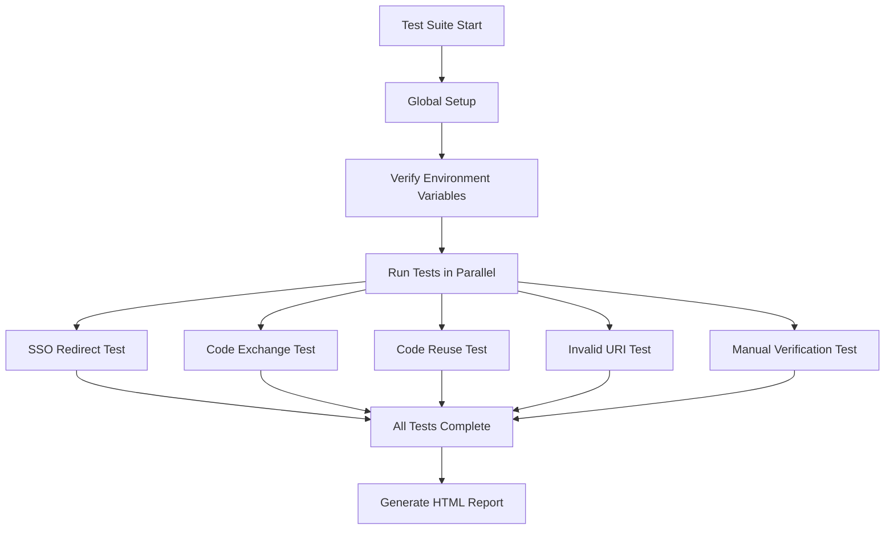

# SSO E2E Testing Guide

## ✅ All Tests Passing!

Your automated E2E test suite for SSO is fully operational.

## What's Tested

The automated tests verify the complete SSO integration flow:

### 1. **SSO Redirect URL Generation** ✅
- Verifies that clicking "Sign In" generates correct SSO parameters
- Checks `app_id`, `redirect_uri`, and `state` (CSRF token)

### 2. **Auth Code Exchange** ✅
- Tests the `/api/auth/exchange` endpoint
- Verifies valid codes return user data and `app_claims`
- Confirms `app_claims.enabled` and role assignment work correctly

### 3. **Security: Code Reuse Prevention** ✅
- Tests that auth codes are single-use
- Attempting to reuse a code returns 400 error

### 4. **Security: Invalid Redirect URI** ✅
- Verifies malicious callback URLs are blocked
- Ensures users can't be redirected to unauthorized domains

### 5. **Manual Verification Test** ✅
- Documents the expected user flow
- Useful for manual spot-checking

## Running Tests

```bash
# Run all E2E tests
pnpm test:e2e

# Run with interactive UI
pnpm test:e2e:ui

# Run in headed mode (see the browser)
pnpm test:e2e:headed

# Debug a specific test
pnpm test:e2e:debug

# View the last test report
pnpm test:e2e:report
```

## Test Configuration

- **Test files:** `e2e/sso-simple.spec.ts`
- **Test utilities:** `e2e/utils/test-helpers.ts`
- **Config:** `playwright.config.ts`
- **Environment:** Uses your `.env.local` file automatically
- **Browser:** Chromium (can add more in playwright.config.ts)

## Key Features

✅ **No separate .env.test required** - Uses your existing `.env.local`
✅ **Uses real user account** - No test user creation needed
✅ **Auto-cleanup** - Test data is cleaned up after each run
✅ **Parallel execution** - Tests run simultaneously for speed
✅ **CI-ready** - GitHub Actions workflow included

## Test Architecture



## What Each Test Validates

| Test | What It Checks | Why It Matters |
|------|----------------|----------------|
| **SSO Redirect URL** | Correct parameters in redirect | Ensures SSO handshake initiates properly |
| **Code Exchange** | Valid codes return user data | Core SSO functionality |
| **Code Reuse** | Used codes can't be reused | Prevents replay attacks |
| **Invalid Redirect** | Bad URLs are rejected | Prevents open redirect vulnerabilities |
| **Manual Verification** | Documents expected behavior | Useful for debugging |

## Adding More Tests

To add new SSO tests, edit `e2e/sso-simple.spec.ts`:

```typescript
test('your new test name', async ({ page, request }) => {
  // Your test code here
});
```

Use helper functions from `e2e/utils/test-helpers.ts`:
- `ensureTestUser()` - Get/create test user
- `grantUserAppAccess(userId, appId, role)` - Manage access
- `cleanupOldAuthCodes()` - Clean expired codes
- `supabase` - Authenticated Supabase client

## CI/CD Integration

Tests run automatically on every push/PR via GitHub Actions:

- Workflow: `.github/workflows/e2e-tests.yml`
- Runs on: `ubuntu-latest`
- Reports: Uploaded as artifacts (viewable in GitHub Actions UI)

## Troubleshooting

### Tests fail with "Cannot find module"

Run `pnpm install` to ensure all dependencies are installed.

### Tests timeout

Increase timeout in individual tests or in `playwright.config.ts`.

### "demo-app not found" errors

Ensure you've run the SSO setup SQL to create the `demo-app` and configure callback URLs.

### Different results locally vs CI

Check that CI environment has the same database schema (migrations applied).

## Next Steps

- [ ] Add tests for different auth methods (passkeys, OAuth)
- [ ] Add tests for app-specific roles and permissions
- [ ] Add tests for SSO with app secrets
- [ ] Add tests for expired codes (time-based)
- [ ] Add visual regression tests (screenshots)
